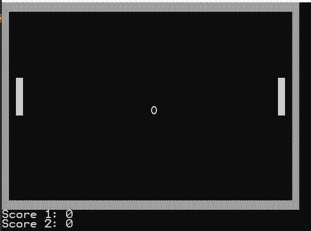
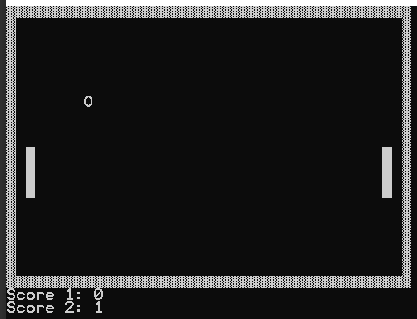
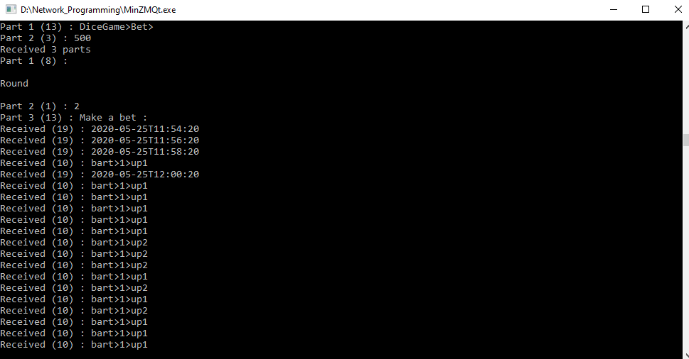
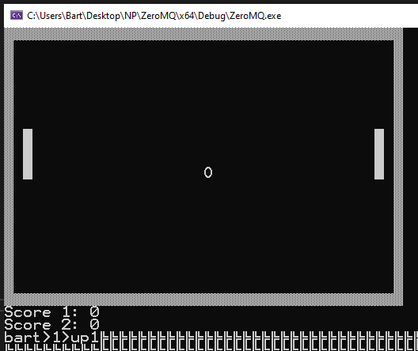

# Network Programming Pong game 
Made by students of [the hogeschool PXL](https://www.pxl.be).

The purpose of this project is to develop a simple C/C++ application through a client/server.

For this Project the [ZMQ Library](https://zeromq.org/languages/cplusplus/) is used.

On the client you control the rackets for the pong game. Data gets send through the broker to the game where the rackets respond to the clients commands. 

The broker receives the following message format: user>command number>command. 
These are all the available commands:
| Command       	    | Keybind       |
| ----------------------|:-------------:|
| move left paddle up   | 'Z'  	        |
| move left paddle down | 'S'           |
| move right paddle up  | 'I'           |
| move right paddle down| 'K'  			|
| quit game				| 'Q' 			| 

Flowchart:

Playfield:

Score:

Data on the broker:

## Troubleshooting
during this project there are issues with filtering the buffer correctly. 
The buffer gets filled with 'junk' data after the message has been inserted. This has been fixed with resizing the buffer. 

* Bart Gripsen      [LinkedIn](linkedin.com/in/bart-grispen-9634b1181)