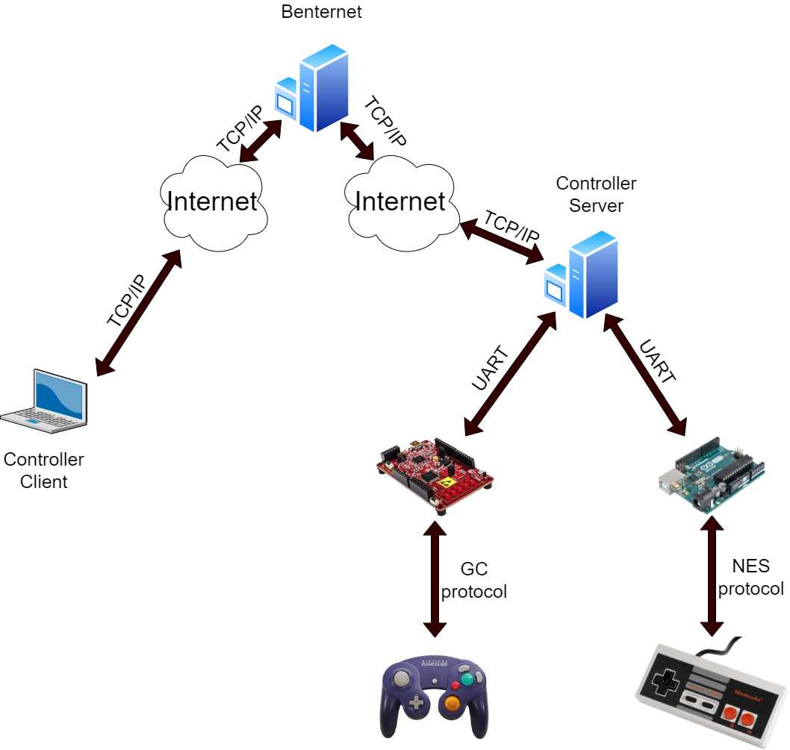

# CZMQ: Controller-Server
The purpose of this project is to create a server which can send the state of a game controller over a ZMQ network. It automatically handles the update interval and communication over serial connection.

Although you can add a wide variety of input, 2 types of controllers have already been implemented: a NES and an original GC controller. The code to program the microcontrollers which connect to the NES and GC controllers has been included in the microcontroller_code folder.

## Requirements

  ### Software
  * Visual studio 2019
  * Arduino IDE 1.8.10
  * PSoC creator 4.3
  
  ### Libraries
  * Serial library(.lib in proj)  https://github.com/wjwwood/serial
  * CZMQ                          https://joshuaburkholder.com/wordpress/2018/05/25/build-and-static-link-zeromq-on-windows/
  
  ### Hardware
  * PSoc 4 Pioneer kit (CY8CKIT-042)
  * Arduino Uno (or compatible)
  * NES controller (with 7 pin connector)
  * GC controller (original)
  

## Scheme
<p align="center"></p>
  
## Protocol
This service runs on a simple string-based protocol where commands separated by a '>' sign are send over the network. Several commands can be send to the server, and controllerstatus and error codes are received. All the controllers connected to the server get assigned a certain ID. This list can be requested from the server by sending a certain request (see below).

The main channel that a client has to subscribe to is the "controllerService!>" channel. All responses from the server happen with this first command. All the request from the client have to be made to the "controllerService?>" channel. Below is a detailed overview of all commands used in this system. All values between ## have to be replaced by a certain value (do not include the #!).

An example client has been included under controllerClient which can request and set data from a NES and GC controller.

### Request from client --> server
```
controllerservice?>contr>#ID#>sUpdate>#update in ms#>
```
* Sets the updateSpeed of a controller with a certain ID in milliseconds<br>
```
controllerservice?>contr>#ID#>gUpdate>
```
* Gets the updateSpeed of a controller with a certain ID<br>
```
controllerservice?>contr>#ID#>sRumble>#1 or 0#>
```
* Sets the rumble to ON (1) or OFF (0) of a controller with a certain ID<br>
```
controllerservice?>contr>#ID#>gRumble>
```
* Gets the rumble of a controller with a certain ID<br>
```
controllerservice?>serv>gList>
```
* Gets a list of all the controllers connected to the server. (more info under respons)<br>

### Respons from server --> client
```
controllerservice!>contr>#ID#>gUpdate>#updatespeed in ms#>
```
* Gets the updateSpeed of a controller with a certain ID <br>
```
controllerservice!>contr>#ID#>gRumble>#1 or 0">
```
* Get the rumble ON (1) or OFF (0) of a controller with a certain ID<br>
```
controllerservice!>serv>gList>
```
* Gets a list of all the controllers connected to the server. Currently only 2 types are supported: NES and GC. 
The place in the respons string indicates which ID they have: the first one has ID 0, the second one ID1, ...
The values returned are separated by comma's. e.g.: controllerService!>serv>gList>NES,GC> (NES=ID0, GC=ID1)<br>
```
controllerService!>err>INV_UPD_SPEED>
```
* a wrong updatespeed has been given. make sure it's between 10 and 20000 ms
```
controllerService!>err>INV_1ST_COM>
```
* a wrong 1st command has been given (controllerService!> not included)
```
controllerService!>err>INV_CONTR_NUM>
```
* a wrong ID has been given
```
controllerService!>err>INV_3RD_COM>
```
* a wrong 3rd command has been given (controllerService!> not included)
```
